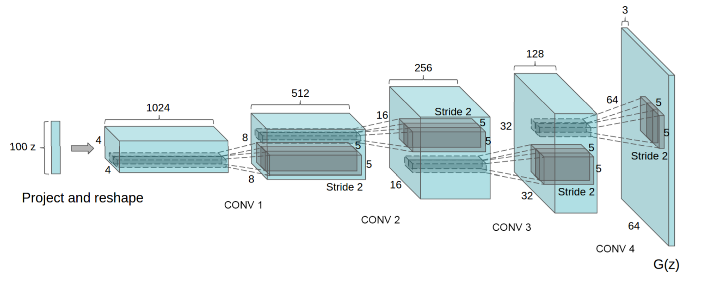
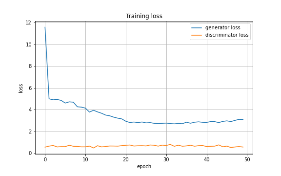
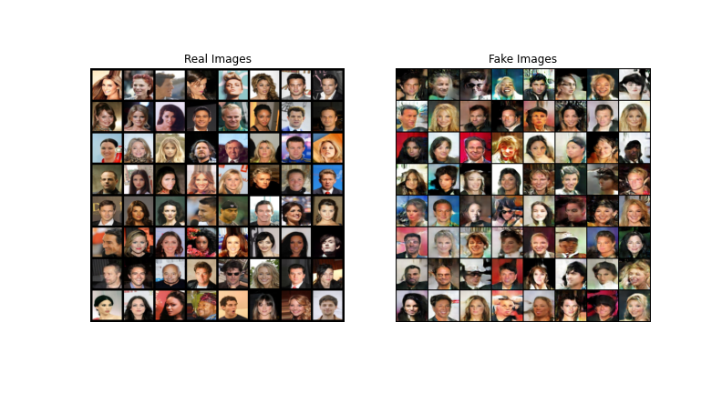

Deep Convolutional GAN-pytorch
==============================
A Pytorch implementation of Deep Convolutional GAN (DCGAN).

[DCGAN](https://arxiv.org/pdf/1511.06434.pdf) is a first deep convolutional generative model which allows to
generate high-quality images, compared to previous methods. It does it by using convolutional layers rather than
fully-connected ones. DCGAN Generator architecture is shown below:

<a>

    

</a>

## Table of content

- [Training](#train)
- [Results](#res)
- [License](#license)
- [Links](#links)

## Training 

Run `train.py` to start training process. 
### Results
##### `Generators` and `Discriminators` losses

<a>

    

</a>

##### `Real` vs `Fake`

<a>

    

</a>

##### Improvement of `Generator` over epochs

## License

This project is licensed under MIT.

## Links

* [Unsupervised Representation Learning with Deep Convolutional Generative Adversarial Networks](https://arxiv.org/abs/1511.06434)
